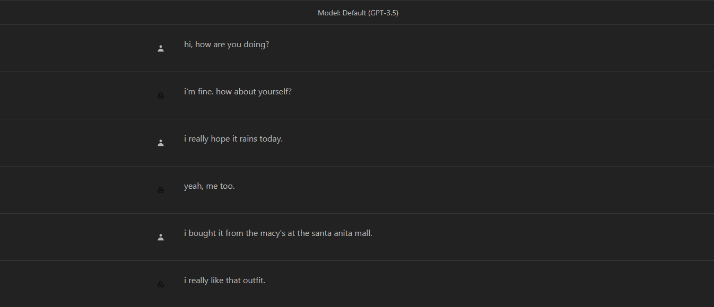
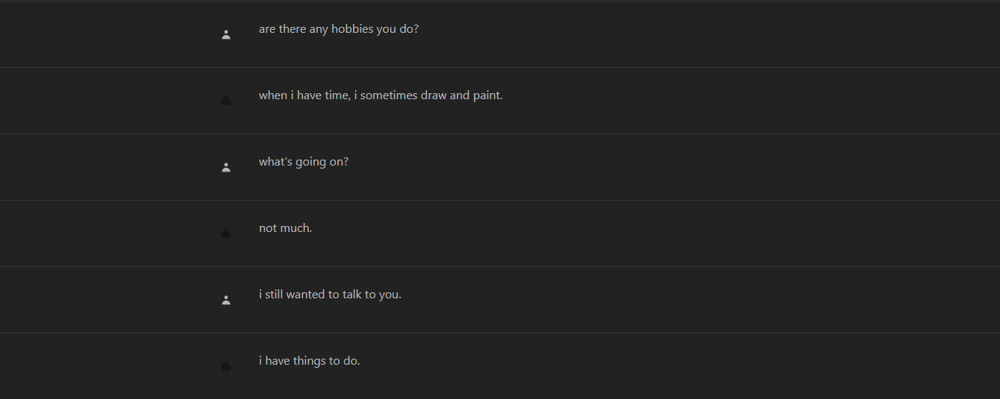
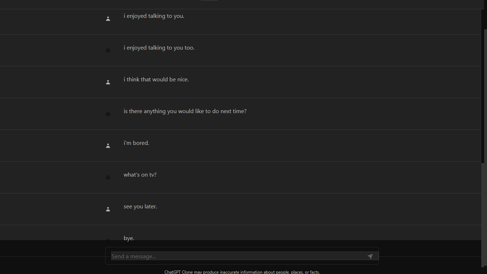

# Chatbot Project Documentation

## Table of Contents
- [Introduction](#introduction)
- [Purpose](#purpose)
- [Usage](#usage)
- [Built With](#built-with)
- [Chatbot Conversations](#chatbot-conversations)

## Introduction

Welcome to the documentation for our chatbot project. This document provides an overview of the project's purpose, how to use it, and the technologies used in its development.

## Purpose

The purpose of this project is to create a chatbot that provides exceptional customer service by answering user queries on a website or application. The chatbot aims to deliver high-quality support to users, ensuring a positive user experience and customer satisfaction.

## Usage

### Accessing the Chatbot

To interact with the chatbot, please visit our web page at [Chatbot Web Page](https://carla-chatbot.vercel.app).

### Basic Usage

1. Visit the provided web page.
2. Sign in or create an account using NextAuth.js authentication.
3. Start a conversation with the chatbot.
4. The chatbot will provide responses to your queries.

## Built With

The chatbot project was built using the following technologies:

- Python
- Flask
- Transformers Library (for GPT-3 integration)
- Next.js (for the web page)
- NextAuth.js (for authentication)
- Vercel (for web app deployment)
- Render (for hosting the Flask app)

## Chatbot Conversations

Below are screenshots of sample chatbot conversations to demonstrate its functionality:

- 
- 
- 

## Feedback

We value user feedback to make continuous improvements to our chatbot. If you have any comments or suggestions, please feel free to share them with us.

Thank you for using our chatbot!

